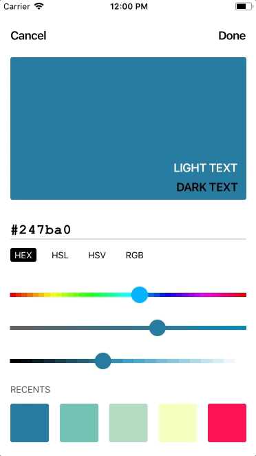
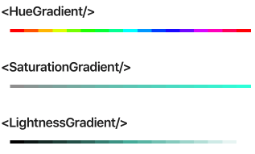
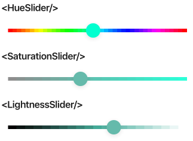

# 

Color components for React Native. JavaScript-only, for iOS and Android.

[](https://www.npmjs.com/package/react-native-color)
[](https://opensource.org/licenses/MIT)
[](https://www.npmjs.com/package/react-native-color)

## Example
- Run the example app [via Expo](https://expo.io/@hectahertz/react-native-color-example) or [check the code](example/App.js).

## SlidersColorPicker
Based on a [Dribbble concept](https://dribbble.com/shots/3959594-Color-Picker-Concept?utm_source=Twitter_Shot) by [Satyajit Sahoo](https://twitter.com/satya164).




## Gradients
With a customizable number of steps, shape and direction.



## Sliders
The simplest hue/staturation/value selectors!



## Setup
```sh
yarn add react-native-color
```
Or, if you use npm, `npm i --save react-native-color`.

## Roadmap
- Make the color string editable
- Support different color modes for the return string of the pickers
- Support different color modes for the sliders of the <SliderPicker/>
- Gradient that mixes two colors
- Add documentation for the props
- Support for themes/render customizations
- Export separate components for a build-your-own philosophy
- Type with [Flow](https://flow.org/)

## Contact

[Tweet me @hectahertz](https://twitter.com/hectahertz)